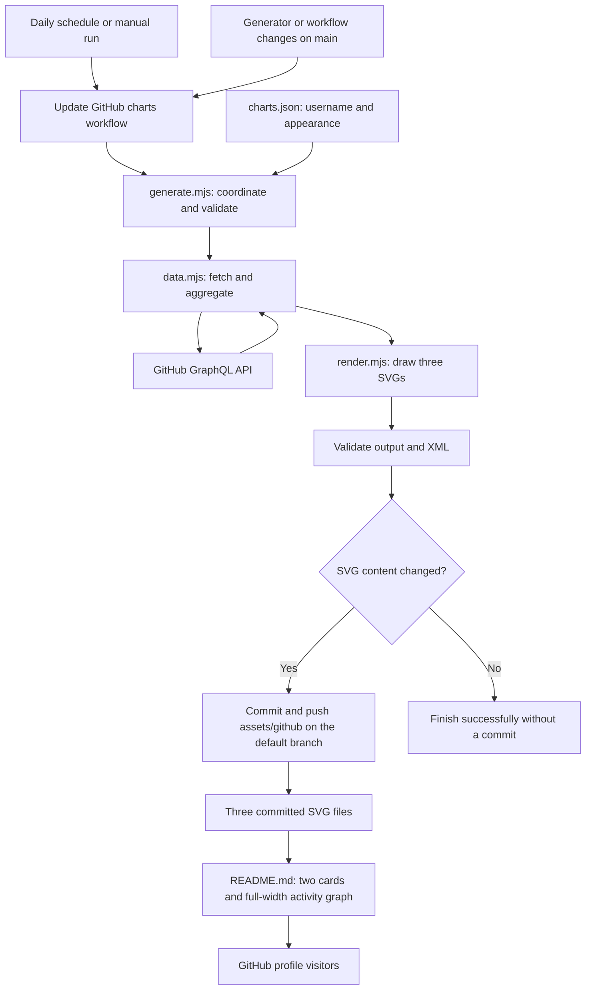
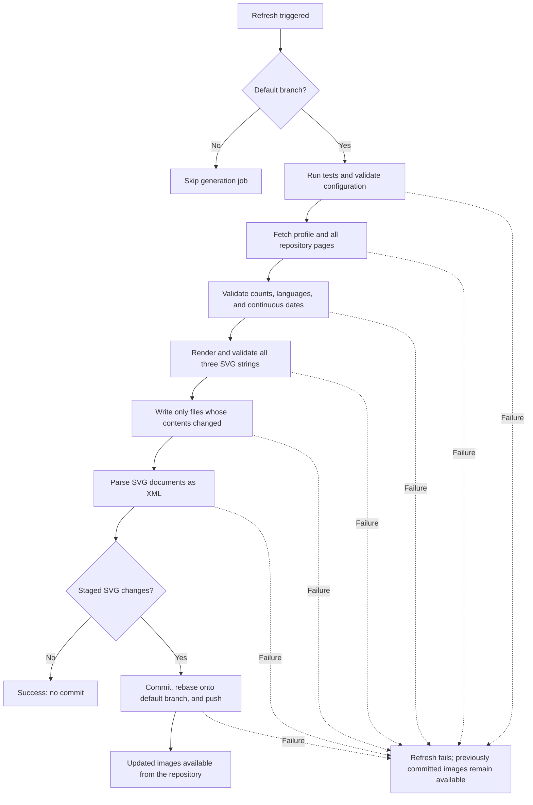

# Profile charts: architecture and maintenance

The repository generates and stores all three profile charts itself. GitHub provides the data through its GraphQL API, runs the scheduled workflow, and serves the committed SVGs. Chart generation uses Node.js built-ins and has no runtime npm dependencies or external hosting requirement.

## Architecture



Viewing the README does not trigger API requests or generation. Visitors receive the saved images without supplying credentials. SVGs contain their own paths, text, colors, and geometry; they do not load scripts, remote images, or remote fonts. Fonts are resolved by the viewer's system.

## Files and responsibilities

| File                                                                        | Responsibility                                                                        |
| --------------------------------------------------------------------------- | ------------------------------------------------------------------------------------- |
| [README.md](README.md)                                                      | Existing profile table and local image references.                                    |
| [charts.json](scripts/github/charts.json)                                   | Account, colors, dimensions, and chart limits.                                        |
| [data.mjs](scripts/github/data.mjs)                                         | GraphQL requests, pagination, aggregation, and contribution dates.                    |
| [render.mjs](scripts/github/render.mjs)                                     | Independently implemented SVG rendering for all three charts.                         |
| [generate.mjs](scripts/github/generate.mjs)                                 | Configuration and data validation, rendering, output checks, and changed-file writes. |
| [charts.test.mjs](scripts/github/charts.test.mjs)                           | Automated behavior and regression checks.                                             |
| [Generator README](scripts/github/README.md)                                | Short operational reference.                                                          |
| [github-stats.svg](assets/github/github-stats.svg)                          | Stars, commits, PRs, issues, contributed repositories, icons, and rank ring.          |
| [top-languages.svg](assets/github/top-languages.svg)                        | Compact language bar and two-column legend.                                           |
| [activity-graph.svg](assets/github/activity-graph.svg)                      | Contribution line, points, area fill, grid, and axes.                                 |
| [Update workflow](.github/workflows/update-github-charts.yml)               | Tests, generation, XML validation, and publication.                                   |
| [Quality workflow](.github/workflows/check-quality.yml)                     | Formatting checks and tests for development changes.                                  |
| [package.json](package.json) and [package-lock.json](package-lock.json)     | Development commands and the exact formatter dependency.                              |
| [.prettierrc.json](.prettierrc.json) and [.prettierignore](.prettierignore) | Formatting rules and exclusions.                                                      |
| [.editorconfig](.editorconfig) and [.gitattributes](.gitattributes)         | Editor whitespace settings and Git line endings.                                      |
| [.gitignore](.gitignore)                                                    | Excludes installed development dependencies.                                          |

## Activation and manual refresh

1. Commit and push the implementation, workflows, and generated assets to the profile repository's default branch, currently `main`.
2. Ensure GitHub Actions is enabled and repository rules permit the chart workflow's bot commit to that branch. If rules reject the push, resolve the specific restriction through the repository's approved process.
3. Open **Actions → Update GitHub charts → Run workflow** and select the default branch.
4. Confirm the job succeeds. Changed images produce a commit; unchanged images finish successfully without one.
5. Open the repository README and profile to check that all three images load and retain the expected layout.

No repository secrets need to be configured manually. The workflow receives GitHub's automatic `GITHUB_TOKEN`. No separate deployment, server, hosting account, or personal access token is required for the scheduled setup.

The initial images use the public snapshot captured during migration. The first successful generation run refreshes them from the API. Local checks do not establish that the workflow has run on GitHub; activation and a successful live run must be confirmed after pushing.

## Workflows

| Workflow             | Triggers                                                                                                                   | Permissions and behavior                                                                                                       |
| -------------------- | -------------------------------------------------------------------------------------------------------------------------- | ------------------------------------------------------------------------------------------------------------------------------ |
| Update GitHub charts | Daily at **03:23 UTC / 08:53 IST**; manual dispatch; pushes to `main` changing `scripts/github/**` or the update workflow. | Generation job has `contents: write`; runs only on the default branch; 15-minute timeout; concurrent refreshes are serialized. |
| Check code quality   | Pull requests and pushes to `main`, except changes confined to the profile README and generated assets.                    | `contents: read`; checkout does not retain credentials; 5-minute timeout; superseded runs for the same ref are canceled.       |

Both workflows use Node.js 24 and commit-pinned GitHub setup actions. Only the quality workflow installs npm development tools. A formatter installation problem therefore does not interrupt scheduled chart generation.

Scheduled runs use the default branch. If the default branch is renamed, update both workflows' explicit `push.branches` filters; the generation guard, checkout, and publication target already use the repository's default-branch value. Configuring a quality check as a required merge check is a separate repository setting.

## Refresh and failure flow



Each API request has a 30-second timeout. Connection failures and server errors receive at most three attempts, with 2-second and 4-second waits. Rate-limit responses, other HTTP errors, partial GraphQL results, and invalid data stop the refresh. Missing contribution days are rejected rather than converted into zero activity.

All three SVG strings pass validation before any file is written. Filesystem writes are sequential, not a multi-file transaction; a local I/O failure can leave partial working-tree changes. In Actions, publication occurs only after generation and XML validation succeed, so those failures do not replace committed images. Publication uses a normal push, never a force push; an unresolved rebase or rejected push fails the job.

Output has no generation timestamps. Identical inputs produce identical SVGs, and unchanged files are not rewritten. Advancing the graph's date window can legitimately change an image even when contribution counts remain flat.

## Metrics and interpretation

| Metric                     | Definition                                                                                                                                                                                                                                                                 |
| -------------------------- | -------------------------------------------------------------------------------------------------------------------------------------------------------------------------------------------------------------------------------------------------------------------------- |
| Total Stars                | Sum of stars on public, owned, non-fork repositories.                                                                                                                                                                                                                      |
| Total Commits              | GitHub's commit contribution count for the preceding year, subject to its contribution rules and token visibility.                                                                                                                                                         |
| Total PRs and Total Issues | Lifetime counts returned for the account and visible to the workflow token.                                                                                                                                                                                                |
| Contributed To             | GitHub's recent public contributed-repository count for commits, issues, and PRs, excluding owned repositories. This query does not supply a custom date range.                                                                                                            |
| Rank ring                  | Local activity-score heuristic combining commits, PRs, issues, reviews, stars, and followers. Reviews cover the preceding year. The formula and grade thresholds are in `rank()` in `render.mjs`; this is not an official GitHub rank or a measured population percentile. |
| Top Languages              | Language bytes summed across public, owned, non-fork repositories, sorted by size. The largest eight are displayed, with percentages normalized across the displayed languages.                                                                                            |
| Activity Graph             | GitHub contribution-calendar counts for 31 consecutive days. The final day is today in UTC if it has activity; otherwise it is yesterday. Contributions include more than commits.                                                                                         |

Repository pages are fetched in batches of 100. The first request includes both profile data and the first repository page, so accounts with at most 100 eligible repositories need one request. Each repository supports up to 100 language entries; if GitHub reports more, generation fails instead of silently truncating the totals. Empty accounts are supported.

Public repository selection is explicit. Contribution visibility still follows GitHub's API and profile settings. The implementation does not promise access to private activity elsewhere. Language proportions describe code composition, not experience or skill; the original note remains in the profile README.

## Appearance and configuration

Edit [charts.json](scripts/github/charts.json) to configure generation. Color values are six hexadecimal digits without `#`.

| Setting                   | Current value                                                |
| ------------------------- | ------------------------------------------------------------ |
| Username                  | `akasewang`                                                  |
| Background                | `020617`                                                     |
| Title                     | `7dd3fc`                                                     |
| Text                      | `e0f2fe`                                                     |
| Accent and graph line     | `38bdf8`                                                     |
| Border and graph area     | `1d4ed8`                                                     |
| Graph points              | `ffffff`                                                     |
| Border radius             | `14`                                                         |
| Stats intrinsic size      | `437 × 195`; displayed at `420px` in the README.             |
| Languages intrinsic width | `420`; displayed at `420px`; height follows the legend rows. |
| Languages displayed       | Up to `8`, in a compact bar with a two-column legend.        |
| Graph intrinsic size      | `1200 × 420`; displayed at `100%` width.                     |
| Graph window              | `31` days.                                                   |

The stats coordinate width accommodates its long labels. README display widths are separate HTML attributes. The existing six navigation links, two-card table, note, and bottom graph remain intact.

The graph uses a monotone cubic line, white points, and blue area fill. Metric icons and curves are independently drawn, so minor glyph and curve differences are possible. The stats ring embeds the GitHub mark at its original 66px size. All SVG content appears immediately; there are no entrance animations. Rendering can also vary slightly with system fonts.

The Skills section sits between the navigation links and charts. Empty table rows with a 4px height separate navigation from Skills and Skills from charts. Its icons are static SVGs in `assets/skill-icons/`, displayed at 28px with accessible names. Sixteen cells per row share the outer table borders, with empty cells completing the final row and no nested-table inset. The table uses 48 logical columns to align six navigation links, sixteen skill cells, and two chart cards. GitHub controls table padding and strips custom layout CSS, so column counts remain fixed and cell dimensions cannot stay exactly square at every viewport width. Icons are maintained separately from the generated charts and do not require an icon-hosting service.

## Development and formatting

Use Node.js 24. From the repository root:

```sh
npm ci --ignore-scripts
npm run format
npm run format:check
npm test
```

Tests can run without installing development tools:

```sh
node --test scripts/github/charts.test.mjs
```

To generate locally, first supply `GITHUB_TOKEN` through your environment's secret-management mechanism, then run:

```sh
node scripts/github/generate.mjs
```

GitHub supplies the token automatically inside Actions, not in a local shell. Never place a token in source files, configuration, command examples, query strings, or committed output. Manual workflow dispatch is the simplest refresh option without configuring a local credential.

Prettier is an exact, locked development dependency. Its rules use two-space indentation, semicolons, single quotes, trailing commas, arrow parentheses, object spacing, LF endings, and a 100-column wrapping target. Markdown wrapping and embedded template contents are preserved. EditorConfig coordinates editor whitespace, and Git attributes normalize line endings for the listed file types.

The profile README, generated SVGs, and npm lockfile are excluded from Prettier. This preserves profile markup and deterministic generated output; npm maintains its lockfile. The renderer formats SVGs with two-space indentation, separate elements, expanded CSS rules, LF endings, and a final newline. Text and path values remain intact. Formatting checks enforce presentation, while tests check behavior. The quality workflow checks both.

For routine maintenance, edit source or configuration, run formatting and tests, review the diff, and push through the repository's normal process. Regenerate SVGs through the generator rather than editing them by hand. Update action pins and formatter versions deliberately, retaining the lockfile and rerunning checks.

## Verification and troubleshooting

Local verification during implementation covered formatting, JavaScript syntax, workflow linting, GraphQL query validation, SVG XML and reference checks, deterministic regeneration, and visual inspection of the three images in the README layout. The tests cover pagination, retry boundaries, date completeness, escaping, empty data, SVG formatting, curve behavior, unchanged-file handling, and preservation of existing files when input validation fails.

| Symptom                                       | Check or action                                                                                                                                                                                         |
| --------------------------------------------- | ------------------------------------------------------------------------------------------------------------------------------------------------------------------------------------------------------- |
| No scheduled run                              | Confirm workflows are on the default branch and Actions is enabled. Schedules can be delayed or disabled after extended public-repository inactivity; inspect the Actions page and use manual dispatch. |
| Generation step fails                         | Check API availability, token permissions, and recent configuration changes. Partial or malformed data is intentionally rejected. Logs avoid dumping API responses or credentials.                      |
| Commit step reports no changes                | Normal successful behavior; no new commit is necessary.                                                                                                                                                 |
| Commit or push is rejected                    | Inspect repository rules and workflow write permissions. Resolve the specific restriction or branch conflict, then rerun.                                                                               |
| Images appear stale after a successful update | Confirm the SVG commit is on the default branch. GitHub may cache rendered README images.                                                                                                               |
| Image is missing                              | Confirm the corresponding SVG exists at the exact relative README path and the repository is publicly accessible. Check the last successful refresh.                                                    |
| Counts differ from expectations               | Review metric definitions, contribution eligibility, public repository selection, language normalization, and the graph's UTC window.                                                                   |

This setup removes dependence on public chart-generation services, but still depends on GitHub for data, automation, and asset delivery. It refreshes saved images periodically rather than on every profile view. A failed refresh leaves the last committed version available; it does not provide an independent backup if GitHub itself is unavailable.
