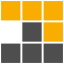
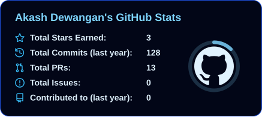
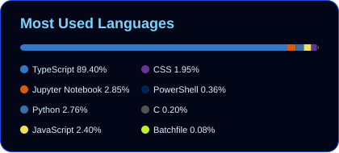
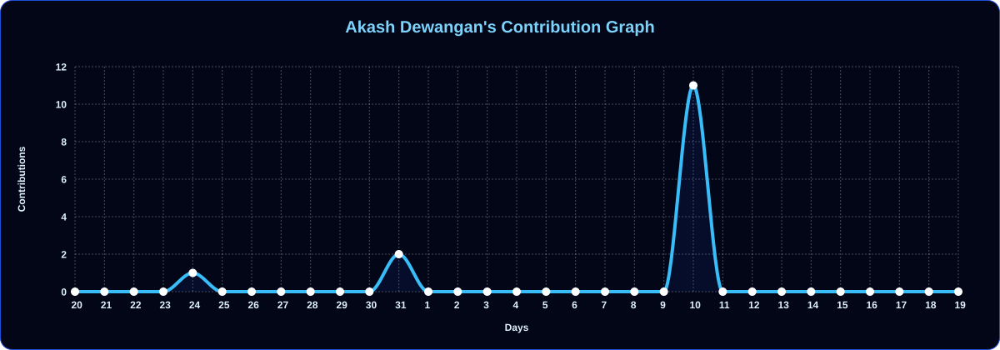

<table align="center" width="100%">
  <tr align="center">
    <td colspan="8" width="16.6%"><samp><a href="https://www.akasewang.me">me</a></samp></td>
    <td colspan="8" width="16.6%"><samp><a href="https://www.akasewang.me/blogs">blog</a></samp></td>
    <td colspan="8" width="16.6%"><samp><a href="https://www.akasewang.me/projects">projects</a></samp></td>
    <td colspan="8" width="16.6%"><samp><a href="https://ui.manakin.studio/">components</a></samp></td>
    <td colspan="8" width="16.6%"><samp><a href="https://x.com/akasewang">tweets</a></samp></td>
    <td colspan="8" width="16.6%"><samp><a href="https://www.akasewang.me/photos">photos</a></samp></td>
  </tr>

  <tr align="center">
    <th colspan="48">Skills</th>
  </tr>

  <tr align="center">
    <td colspan="3" width="6.25%" height="44">
      
    </td>
    <td colspan="3" width="6.25%" height="44">
      
    </td>
    <td colspan="3" width="6.25%" height="44">
      
    </td>
    <td colspan="3" width="6.25%" height="44">
      
    </td>
    <td colspan="3" width="6.25%" height="44">
      
    </td>
    <td colspan="3" width="6.25%" height="44">
      
    </td>
    <td colspan="3" width="6.25%" height="44">
      
    </td>
    <td colspan="3" width="6.25%" height="44">
      
    </td>
    <td colspan="3" width="6.25%" height="44">
      
    </td>
    <td colspan="3" width="6.25%" height="44">
      
    </td>
    <td colspan="3" width="6.25%" height="44">
      
    </td>
    <td colspan="3" width="6.25%" height="44">
      
    </td>
    <td colspan="3" width="6.25%" height="44">
      
    </td>
    <td colspan="3" width="6.25%" height="44">
      
    </td>
    <td colspan="3" width="6.25%" height="44">
      
    </td>
    <td colspan="3" width="6.25%" height="44">
      
    </td>
  </tr>

  <tr align="center">
    <td colspan="3" width="6.25%" height="44">
      
    </td>
    <td colspan="3" width="6.25%" height="44">
      
    </td>
    <td colspan="3" width="6.25%" height="44">
      
    </td>
    <td colspan="3" width="6.25%" height="44">
      
    </td>
    <td colspan="3" width="6.25%" height="44">
      
    </td>
    <td colspan="3" width="6.25%" height="44">
      
    </td>
    <td colspan="3" width="6.25%" height="44">
      
    </td>
    <td colspan="3" width="6.25%" height="44">
      
    </td>
    <td colspan="3" width="6.25%" height="44">
      
    </td>
    <td colspan="3" width="6.25%" height="44">
      
    </td>
    <td colspan="3" width="6.25%" height="44">
      
    </td>
    <td colspan="3" width="6.25%" height="44">
      
    </td>
    <td colspan="3" width="6.25%" height="44">
      
    </td>
    <td colspan="3" width="6.25%" height="44">
      
    </td>
    <td colspan="3" width="6.25%" height="44">
      
    </td>
    <td colspan="3" width="6.25%" height="44">
      
    </td>
  </tr>

  <tr align="center">
    <td colspan="3" width="6.25%" height="44">
      
    </td>
    <td colspan="3" width="6.25%" height="44">
      
    </td>
    <td colspan="3" width="6.25%" height="44">
      
    </td>
    <td colspan="3" width="6.25%" height="44">
      
    </td>
    <td colspan="3" width="6.25%" height="44">
      
    </td>
    <td colspan="3" width="6.25%" height="44">
      
    </td>
    <td colspan="3" width="6.25%" height="44">
      
    </td>
    <td colspan="3" width="6.25%" height="44">
      
    </td>
    <td colspan="3" width="6.25%" height="44"></td>
    <td colspan="3" width="6.25%" height="44"></td>
    <td colspan="3" width="6.25%" height="44"></td>
    <td colspan="3" width="6.25%" height="44"></td>
    <td colspan="3" width="6.25%" height="44"></td>
    <td colspan="3" width="6.25%" height="44"></td>
    <td colspan="3" width="6.25%" height="44"></td>
    <td colspan="3" width="6.25%" height="44"></td>
  </tr>

  <tr align="center">
    <th colspan="24">GitHub Stats</th>
    <th colspan="24">Top Languages</th>
  </tr>

  <tr align="center">
    <td colspan="24" valign="top">
      
    </td>
    <td colspan="24" valign="top">
      
    </td>
  </tr>

  <tr align="center">
    <td colspan="48">
      
<strong>Note:</strong> Top languages is only a metric of the languages my public code consists of and doesn't reflect experience or skill level.

    </td>
  </tr>

  <tr align="center">
    <td colspan="48">
      
    </td>
  </tr>
</table>
