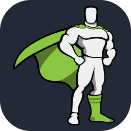
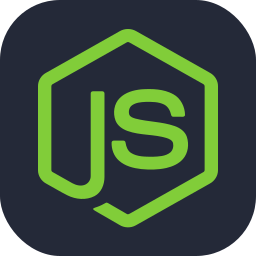
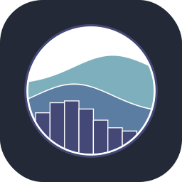
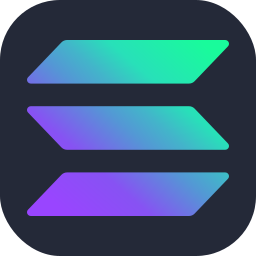

<h2>Summary</h2>

<table>
  <thead>
    <tr>
      <th>&nbsp;&nbsp;&nbsp;&nbsp;&nbsp;&nbsp;&nbsp;Area&nbsp;&nbsp;&nbsp;&nbsp;&nbsp;&nbsp;&nbsp;</th>
      <th>Details</th>
    </tr>
  </thead>
  <tbody>
    <tr>
      <td><strong>Focus</strong></td>
      <td><code>web development / deep learning</code></td>
    </tr>
    <tr>
      <td><strong>About Me</strong></td>
      <td>
        

I'm a data science undergrad with a solid grounding in deep learning, neural networks and computer vision algorithms. Beyond my technical expertise, I am a active open source contributor and a competitive programmer.
<!--I'm a Data Science undergraduate student with a passion for building meaningful projects at the intersection of data, design, and development. I'm deeply immersed in Deep Learning, Web Development, and Competitive Programming. I'm currently building <a href="https://www.404donut.com">404donut</a>, you can explore my <a href="https://www.akasewang.me/projects">projects</a> and <a href="https://www.akasewang.me/demos">demos</a> in my <a href="https://www.akasewang.me">portfolio</a> and follow my learning journey on my <a href="https://www.akasewang.me/posts">personal blog</a>.
Beyond technology, I love exploring the world through travel and my camera lens (view my <a href="https://www.akasewang.me/photos">photography</a>). I'm also an avid consumer of stories in all forms, you can check out my <a href="https://www.akasewang.me/photos">media consumption</a> too.
Currently based in Bengaluru, I'm always open to connecting for a coffee and a good conversation or an exciting collaboration!-->
        

      </td>
    </tr>
    <tr>
      <td><strong>Find Me On</strong></td>
      <td>
        

          
          
          
          <!---->
          <!---->
          <!---->
          <!---->
          
          <!---->
          <!---->
          <!---->
          
        

      </td>
    </tr>
  </tbody>
</table>

<h2>Technical Skills</h2>

<table>
  <thead>
    <tr>
      <th>&nbsp;&nbsp;&nbsp;&nbsp;&nbsp;&nbsp;&nbsp;&nbsp;&nbsp;&nbsp;&nbsp;&nbsp;&nbsp;&nbsp;&nbsp;&nbsp;Category&nbsp;&nbsp;&nbsp;&nbsp;&nbsp;&nbsp;&nbsp;&nbsp;&nbsp;&nbsp;&nbsp;&nbsp;&nbsp;&nbsp;&nbsp;&nbsp;</th>
      <th>Skills</th>
    </tr>
  </thead>
<tbody>
    <tr>
      <td><strong>Programming & Markup</strong></td>
      <td>
        
        
        
        
        
        
        
        
        
        
        
      </td>
    </tr>
    <tr>
      <td><strong>Web Development</strong></td>
      <td>
        
        
        
        
        
        
        
        
        
        
        
        
        
        
        
      </td>
    </tr>
    <tr>
      <td><strong>Databases & ORMs</strong></td>
      <td>
        
        
        
        
        
      </td>
    </tr>
    <tr>
      <td><strong>Cloud, DevOps & Hosting</strong></td>
      <td>
        
        
        
        
        
        
      </td>
    </tr>
    <tr>
      <td><strong>Data Science & Machine Learning</strong></td>
      <td>
        
        
        
        
        
        
        
        
        
        
        
        
        
      </td>
    </tr>
    <tr>
      <td><strong>Blockchain & Web3</strong></td>
      <td>
          
          
      </td>
    </tr>
    <tr>
      <td><strong>Software, Hardware & Tools</strong></td>
      <td>
        
        
        
        
        
        
        
        
        
      </td>
    </tr>
  </tbody>
</table>

<h2>Github Statistics</h2>

<table style="min-width: 800px;">
  <thead>
    <tr>
      <th style="text-align: center;">GitHub Stats</th>
      <th style="text-align: center;">Top Languages</th>
    </tr>
  </thead>
  <tbody>
    <tr>
      <td align="center">
        
      </td>
      <td align="center">
        
      </td>
    </tr>
    <tr>
      <td colspan="2" align="center">
        
<strong>Note:</strong> Top languages is only a metric of the languages my public code consists of and doesn't reflect experience or skill level.

      </td>
    </tr>
    <tr>
      <td colspan="2" align="center">
        
      </td>
    </tr>
  </tbody>
</table>

